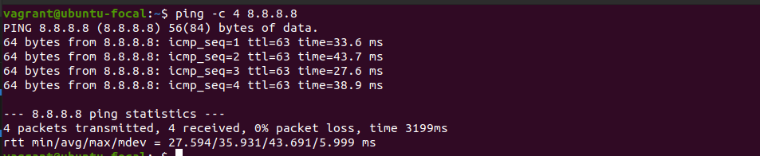

1. ##### grep

grep searches for PATTERNS in each FILE.

`ls -l | grep "altschool"`

2. #### whoami

whoami - print effective userid

`whoami`

3. #### ifconfig

ifconfig - configure a network interface

`ifconfig`

1. #### nslookup

nslookup is a program to query Internet domain name servers.

`nslookup thealtschool.com`

5. #### df

df displays the amount of disk space available on the file system containing each file name argument

`df ~`

6. #### Wget

Wget is a free utility for non-interactive download of files from the Web.

`wget https://www.electrictoolbox.com/images/icons/linux-bsd.gif`

7. #### ping

ping sends ICMP ECHO_REQUEST to network hosts

`ping -c 4 8.8.8.8`

8. #### find

find - search for files in a directory hierarchy

`find ./Altschool -name "linux*" `

9. #### chmod

chmod - change file mode bits

`chmod 744 iCanOnlyBeRunBySU`

10. #### rmdir

rmdir - remove empty directories

`rmdir iamempty`

